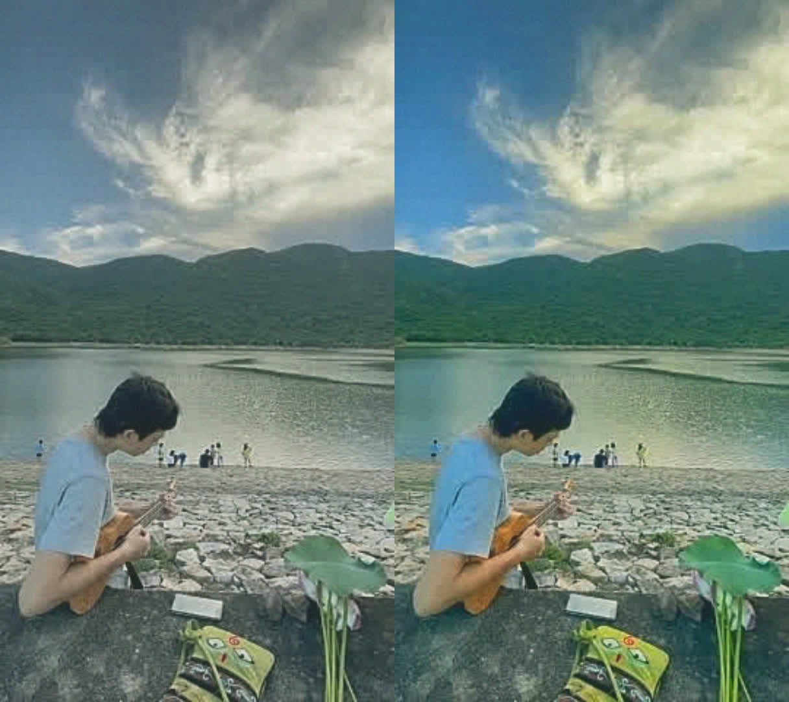

# digicam

Make a video or photo look like it came out of a 2005–2010 digital camera: VGA-ish resolution,
chroma bleed, over-sharpened halos, MJPEG blockiness, lifted blacks with blue shadows, vibrant but
not harsh colour, warm highlight bloom and sensor grain. One bash script on top of `ffmpeg`.

Just want to try it on a photo? **[digicam-phi.vercel.app](https://digicam-phi.vercel.app)** runs the
same pipeline in the browser (source in [`web/`](web)).

## Install

```sh
brew install ffmpeg            # or apt install ffmpeg, etc.
git clone https://github.com/coolcorexix/digicam.git
cd digicam
```

## Use

```sh
./digicam.sh input.mp4 output.mp4
./digicam.sh input.jpg output.png     # try settings on a still first
```

Audio is kept. Video comes out as H.264 + AAC, 24 fps, tagged limited-range BT.709 so it looks
the same in Finder/QuickTime, on phones and after uploading to social apps.

 — left: original grade (`SAT=0.78 VIBRANCE=0 BLEED=0 CSHIFT=0`), right: current defaults.

## Knobs

Set as env vars, e.g. `BLEED=4 CSHIFT=2 SAT=1.15 ./digicam.sh in.mp4 out.mp4`.

| Var | Default | Effect |
|---|---|---|
| `RES` | 480 | Internal resolution (height). 360 / 240 for rougher |
| `SHARP` | 1.6 | Edge halo strength. 0.8 mild, 2.5 harsh |
| `JPEGQ` | 14 | MJPEG quality. 2 clean, 20+ heavy blocking |
| `BLEED` | 2.5 | Horizontal chroma bleed (px at `RES`). 0 off, 4+ heavy |
| `CSHIFT` | 1 | Chroma offset to the right (px). 0 off, 2–3 obvious |
| `SAT` | 1.05 | Overall saturation. 0.78 washed out, 1.3 strong |
| `VIBRANCE` | 0.35 | Boosts dull colours more than strong ones. 0 off |
| `BLOOM` | 0.55 | Highlight glow. 0 off, 1 strong |
| `THRESH` | 170 | Brightness (0–255) where the glow starts |
| `OUTH` | 1080 | Output height. Use 1920 to keep a 1080×1920 portrait at full size |

Chroma bleed blurs only the U/V planes, so it shows up only where coloured areas meet something
else. Neutral/grey regions carry no chroma and stay clean.

## License

[MIT](LICENSE)
